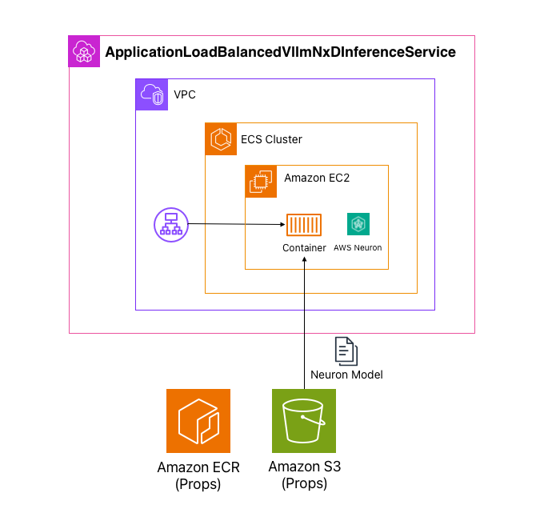
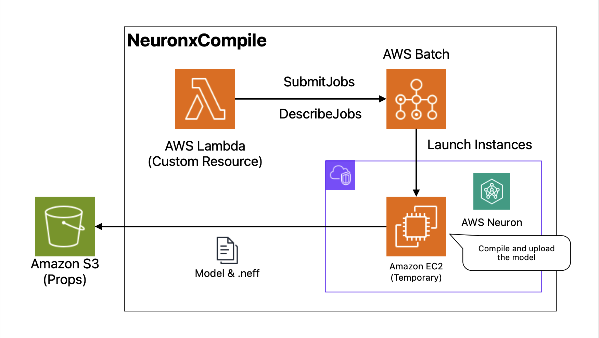

# Neuronx patterns Construct Library

> [!WARNING]
> このライブラリは実験的なモジュールです。

このライブラリは、AWS Neuronx（Inferentia2 や Trainium1 など）を使用した高レベルのアーキテクチャパターンを提供します。以下が含まれます：

- vLLM with NxD Inference on ALB & ECS on EC2
- Neuronx Compiler

[English README is here](./README.md)

## 目次

- [インストール](#インストール)
- [クイックスタート](#クイックスタート)
- [vLLM NxD Inference on ALB & ECS on EC2](#vllm-nxd-inference-on-alb--ecs-on-ec2)
  - [アーキテクチャ](#アーキテクチャ)
  - [基本的な使い方](#基本的な使い方)
  - [完全な例](#完全な例)
  - [特定の公式 AWS Neuron vLLM Image バージョンの使用](#特定の公式-aws-neuron-vllm-image-バージョンの使用)
  - [Secrets を使った HuggingFace Token の使用](#secrets-を使った-huggingface-token-の使用)
- [Neuronx Compiler](#neuronx-compiler)
  - [Spot Instance](#spot-instance)
- [API リファレンス](#api-リファレンス)
- [コストに関する考慮事項](#コストに関する考慮事項)
- [トラブルシューティング](#トラブルシューティング)
- [セキュリティのベストプラクティス](#セキュリティのベストプラクティス)
- [ライセンス](#ライセンス)

## インストール

```bash
# NPM
npm i aws-cdk-neuronx-patterns

# yarn
yarn add aws-cdk-neuronx-patterns

# PNPM
pnpm i aws-cdk-neuronx-patterns
```

## クイックスタート

vLLM 推論サービスをデプロイする最小限の例：

```ts
import * as cdk from "aws-cdk-lib";
import * as ec2 from "aws-cdk-lib/aws-ec2";
import * as s3 from "aws-cdk-lib/aws-s3";
import {
  VllmNxdInferenceCompiler,
  VllmNxdInferenceTaskDefinition,
  ApplicationLoadBalancedVllmNxDInferenceService,
  Model,
} from "aws-cdk-neuronx-patterns";

const app = new cdk.App();
const stack = new cdk.Stack(app, "VllmInferenceStack");

const vpc = new ec2.Vpc(stack, "Vpc", { maxAzs: 2 });
const bucket = new s3.Bucket(stack, "ModelBucket");

const compiler = new VllmNxdInferenceCompiler(stack, "Compiler", {
  vpc,
  bucket,
  model: Model.fromHuggingFace("HuggingFaceTB/SmolLM-135M-Instruct"),
});

const compiledModel = compiler.compile();
const taskDefinition = new VllmNxdInferenceTaskDefinition(stack, "TaskDef", {
  compiledModel,
});

const service = new ApplicationLoadBalancedVllmNxDInferenceService(
  stack,
  "Service",
  { vpc, taskDefinition }
);

new cdk.CfnOutput(stack, "LoadBalancerDNS", {
  value: service.loadBalancer.loadBalancerDnsName,
});
```

## vLLM NxD Inference on ALB & ECS on EC2

> [!WARNING]
> このコンストラクトは EC2 上で Inferentia2 インスタンスを使用します。AWS アカウントで Inferentia2 インスタンスのサービスクォータを増やす必要がある場合があります。[Service Quotas コンソール](https://console.aws.amazon.com/servicequotas/)から申請してください。

このパターンは、モデルのコンパイルに `VllmNxdInferenceCompiler` を、デプロイに `ApplicationLoadBalancedVllmNxDInferenceService` を組み合わせて使用します。HuggingFace で公開されているモデルを簡単にコンパイルし、Application Load Balancer を使った ECS にデプロイできます。

### アーキテクチャ



このコンストラクトは自動的に以下を行います：

- モデルサイズに基づいて最適なテンソル並列化を計算
- ECS タスクのメモリフットプリントを設定
- ヘルスチェック付きの Application Load Balancer をセットアップ
- コンパイル済みモデルを ECS タスクにデプロイ
- オートスケーリングポリシーを設定

このサービスは、Application Load Balancer を通じて REST API エンドポイントを公開し、デプロイされたモデルで推論を実行できます。

### 基本的な使い方

```ts
import * as ec2 from "aws-cdk-lib/aws-ec2";
import * as s3 from "aws-cdk-lib/aws-s3";
import {
  VllmNxdInferenceCompiler,
  VllmNxdInferenceTaskDefinition,
  ApplicationLoadBalancedVllmNxDInferenceService,
  Model,
} from "aws-cdk-neuronx-patterns";

declare const vpc: ec2.Vpc;
declare const bucket: s3.Bucket;

const compiler = new VllmNxdInferenceCompiler(this, "Compiler", {
  vpc,
  bucket,
  model: Model.fromHuggingFace("HuggingFaceTB/SmolLM-135M-Instruct"),
});

const compiledModel = compiler.compile();
const taskDefinition = new VllmNxdInferenceTaskDefinition(
  this,
  "TaskDefinition",
  {
    compiledModel,
  }
);

const service = new ApplicationLoadBalancedVllmNxDInferenceService(
  this,
  "Service",
  {
    vpc,
    taskDefinition,
  }
);
```

### 完全な例

VPC と S3 Bucket の作成、および他の ECS Task からのアクセスを含む完全な例：

```ts
import * as cdk from "aws-cdk-lib";
import * as ec2 from "aws-cdk-lib/aws-ec2";
import * as ecs from "aws-cdk-lib/aws-ecs";
import * as s3 from "aws-cdk-lib/aws-s3";
import {
  VllmNxdInferenceCompiler,
  VllmNxdInferenceTaskDefinition,
  ApplicationLoadBalancedVllmNxDInferenceService,
  Model,
} from "aws-cdk-neuronx-patterns";

export class MyVllmStack extends cdk.Stack {
  constructor(scope: cdk.App, id: string, props?: cdk.StackProps) {
    super(scope, id, props);

    // VPC を作成
    const vpc = new ec2.Vpc(this, "Vpc", {
      maxAzs: 2,
      natGateways: 1,
    });

    // コンパイル済みモデル用の S3 Bucket を作成
    const bucket = new s3.Bucket(this, "ModelBucket", {
      removalPolicy: cdk.RemovalPolicy.DESTROY,
      autoDeleteObjects: true,
    });

    // モデルをコンパイル
    const compiler = new VllmNxdInferenceCompiler(this, "Compiler", {
      vpc,
      bucket,
      model: Model.fromHuggingFace("HuggingFaceTB/SmolLM-135M-Instruct"),
    });

    const compiledModel = compiler.compile();

    // Task Definition を作成
    const taskDefinition = new VllmNxdInferenceTaskDefinition(
      this,
      "TaskDefinition",
      {
        compiledModel,
      }
    );

    // ALB 付きサービスをデプロイ
    const service = new ApplicationLoadBalancedVllmNxDInferenceService(
      this,
      "Service",
      {
        vpc,
        taskDefinition,
      }
    );

    // 他の ECS Task からのアクセスを許可
    const cluster = new ecs.Cluster(this, "AppCluster", { vpc });
    const appTaskDefinition = new ecs.FargateTaskDefinition(
      this,
      "AppTaskDefinition"
    );
    appTaskDefinition.addContainer("app", {
      image: ecs.ContainerImage.fromRegistry("amazon/amazon-ecs-sample"),
      logging: ecs.LogDrivers.awsLogs({ streamPrefix: "app" }),
    });

    const appService = new ecs.FargateService(this, "AppService", {
      cluster,
      taskDefinition: appTaskDefinition,
    });

    // アプリケーションサービスから推論サービスへのアクセスを許可
    service.service.connections.allowFrom(
      appService,
      ec2.Port.tcp(8000),
      "Allow access from application service"
    );

    // Load Balancer の URL を出力
    new cdk.CfnOutput(this, "LoadBalancerURL", {
      value: `http://${service.loadBalancer.loadBalancerDnsName}`,
      description: "推論エンドポイントの Load Balancer URL",
    });
  }
}
```

### 特定の公式 AWS Neuron vLLM Image バージョンの使用

このライブラリは、vLLM 推論用の公式 AWS Neuron Deep Learning Containers をサポートしています。`VllmInferenceNeuronxImage` クラスを使用してこれらのイメージを参照し、`VllmNxdInferenceImage.fromNeuronSdkVersion` を使用して互換性のあるイメージオブジェクトを作成できます：

```typescript
import { VllmNxdInferenceImage, VllmInferenceNeuronxImage } from "aws-cdk-neuronx-patterns";

// 公式 vLLM Neuron Image を使用
const vllmImage = VllmNxdInferenceImage.fromNeuronSdkVersion(
  VllmInferenceNeuronxImage.SDK_2_26_0
);

// タスク定義で使用
const taskDefinition = new VllmNxdInferenceTaskDefinition(
  this,
  "TaskDefinition",
  {
    compiledModel,
    image: vllmImage, // デフォルトは最新の公式 vLLM Neuron Image を使用
  }
);
```

### Secrets を使った HuggingFace Token の使用

HuggingFace のプライベートモデルやゲート付きモデルを使用する場合、認証トークンを提供する必要があります。セキュリティのベストプラクティスとして、HuggingFace Token を AWS Secrets Manager に保存し、コンパイラと推論環境の両方に渡します：

```ts
import * as ec2 from "aws-cdk-lib/aws-ec2";
import * as s3 from "aws-cdk-lib/aws-s3";
import * as batch from "aws-cdk-lib/aws-batch";
import { Secret } from "aws-cdk-lib/aws-secretsmanager";
import {
  VllmNxdInferenceCompiler,
  VllmNxdInferenceTaskDefinition,
  ApplicationLoadBalancedVllmNxDInferenceService,
  Model,
} from "aws-cdk-neuronx-patterns";

declare const vpc: ec2.Vpc;
declare const bucket: s3.Bucket;

// HuggingFace Token を含む既存の Secret を参照
const hfTokenSecret = Secret.fromSecretNameV2(
  this,
  "HFTokenSecret",
  "my-huggingface-token"
);
const hfToken = batch.Secret.fromSecretsManager(hfTokenSecret, "readonlyToken");

// コンパイラに Secret を渡す
const compiler = new VllmNxdInferenceCompiler(this, "Compiler", {
  vpc,
  bucket,
  model: Model.fromHuggingFace("meta-llama/Meta-Llama-3-8B"),
  vllmArgs: {
    hfToken, // HF Token Secret をここで渡す
  },
});

const compiledModel = compiler.compile();
const taskDefinition = new VllmNxdInferenceTaskDefinition(
  this,
  "TaskDefinition",
  {
    compiledModel,
  }
);

const service = new ApplicationLoadBalancedVllmNxDInferenceService(
  this,
  "Service",
  {
    vpc,
    taskDefinition,
  }
);
```

Secret は、コンパイル Batch Job と推論サーバーを実行する ECS Task に環境変数として安全に渡されます。

## Neuronx Compiler

> [!WARNING]
> このコンストラクトは EC2 上で Inferentia2 インスタンスを使用します。AWS アカウントで Inferentia2 インスタンスのサービスクォータを増やす必要がある場合があります。

このコンストラクトは、Neuronx でサポートされているモデルをコンパイルし、指定された S3 バケットにアップロードします。コンストラクトは、モデルのパラメータ数に基づいて必要なインスタンスタイプを自動的に選択します。



```ts
import * as ec2 from "aws-cdk-lib/aws-ec2";
import * as s3 from "aws-cdk-lib/aws-s3";
import { NeuronxCompiler, Model } from "aws-cdk-neuronx-patterns";

declare const vpc: ec2.Vpc;
declare const bucket: s3.Bucket;
declare const image: INeuronxContainerImage;

const compiler = new NeuronxCompiler(this, "NeuronxCompiler", {
  vpc,
  bucket,
  model: Model.fromHuggingFace("HuggingFaceTB/SmolLM-135M-Instruct"),
  artifactS3Prefix: "my-compiled-artifacts",
  image,
});

const compiledModel = compiler.compile();

// この S3 URL からコンパイル済みアーティファクトを取得
new cdk.CfnOutput(this, "CompiledArtifact", {
  value: compiledModel.s3Url,
});
```

### Spot Instance

> [!WARNING]
> Spot Instance を使用する場合は、Spot Instance のサービスクォータが増やされていることを確認してください。

コンパイルに Spot Instance を使用してコストを削減できます：

```ts
import * as ec2 from "aws-cdk-lib/aws-ec2";
import * as s3 from "aws-cdk-lib/aws-s3";
import { NeuronxCompiler, Model } from "aws-cdk-neuronx-patterns";

declare const vpc: ec2.Vpc;
declare const bucket: s3.Bucket;
declare const image: INeuronxContainerImage;

new NeuronxCompiler(this, "NeuronxCompiler", {
  vpc,
  bucket,
  model: Model.fromHuggingFace("HuggingFaceTB/SmolLM-135M-Instruct"),
  artifactS3Prefix: "my-compiled-artifacts",
  image,
  spot: true, // Spot Instance を有効化
});
```

## API リファレンス

詳細な API ドキュメントについては、[API.md](./API.md) を参照してください。

## コストに関する考慮事項

> [!IMPORTANT]
> このライブラリは、コストが発生する AWS リソースをデプロイします：
> - **Inferentia2 インスタンス**（EC2）- 高額な時間単位のコスト
> - **Application Load Balancer** - 時間単位およびデータ処理の料金
> - **NAT Gateway** - 時間単位およびデータ処理の料金
> - **S3 ストレージ** - ストレージおよびリクエストの料金
> - **データ転送** - データ転送アウトの料金

コスト見積もりには、[AWS 料金計算ツール](https://calculator.aws)を使用してください。

**コスト最適化のヒント：**
- コンパイルジョブに Spot Instance を使用（最大 90% の節約が可能）
- 使用していないときはリソースを削除（`cdk destroy`）
- ワークロードに適したインスタンスサイズを使用
- AWS Cost Explorer で使用状況を監視

## トラブルシューティング

### よくある問題

**問題：「Inferentia2 インスタンスのサービスクォータを超過しました」**
- 解決策：[Service Quotas コンソール](https://console.aws.amazon.com/servicequotas/)からクォータの増加をリクエスト
- ナビゲーション：EC2 → Running On-Demand Inf instances

**問題：「コンパイルジョブが失敗する」**
- CloudWatch Logs で AWS Batch Job のログを確認
- HuggingFace にモデルが存在することを確認
- モデルサイズに対して十分なディスクスペースとメモリがあることを確認

**問題：「ECS タスクが起動に失敗する」**
- CloudWatch で ECS Task のログを確認
- S3 Bucket の権限を確認
- S3 にコンパイル済みモデルが存在することを確認

**問題：「ヘルスチェックの失敗」**
- ヘルスチェックの猶予期間を増やす
- Security Group のルールで ALB が ECS Task に到達できることを確認
- コンテナログで起動エラーを確認

### デバッグ

CloudWatch でログを表示：
```bash
# Batch Job のログ
aws logs tail /aws/batch/job --follow

# ECS Task のログ
aws logs tail /ecs/vllm-inference --follow
```

## セキュリティのベストプラクティス

- **Secrets 管理**：機密データ（HuggingFace Token、API Key など）には常に AWS Secrets Manager を使用
- **IAM Role**：IAM Role には最小権限の原則に従う
- **VPC 設定**：
  - ECS Task を Private Subnet にデプロイ
  - Security Group を使用してトラフィックを制限
  - 監視のために VPC Flow Logs を有効化
- **S3 Bucket**：
  - 保管時の暗号化を有効化
  - Bucket Policy を使用してアクセスを制限
  - コンパイル済みモデルのバージョニングを有効化
- **ALB**：
  - 本番環境では ACM 証明書で HTTPS を使用
  - 監査のために Access Logs を有効化

## コントリビューション

コントリビューションを歓迎します！お気軽にプルリクエストを送信してください。

## ライセンス

このライブラリは Apache-2.0 ライセンスの下でライセンスされています。詳細は [LICENSE](./LICENSE) ファイルを参照してください。
