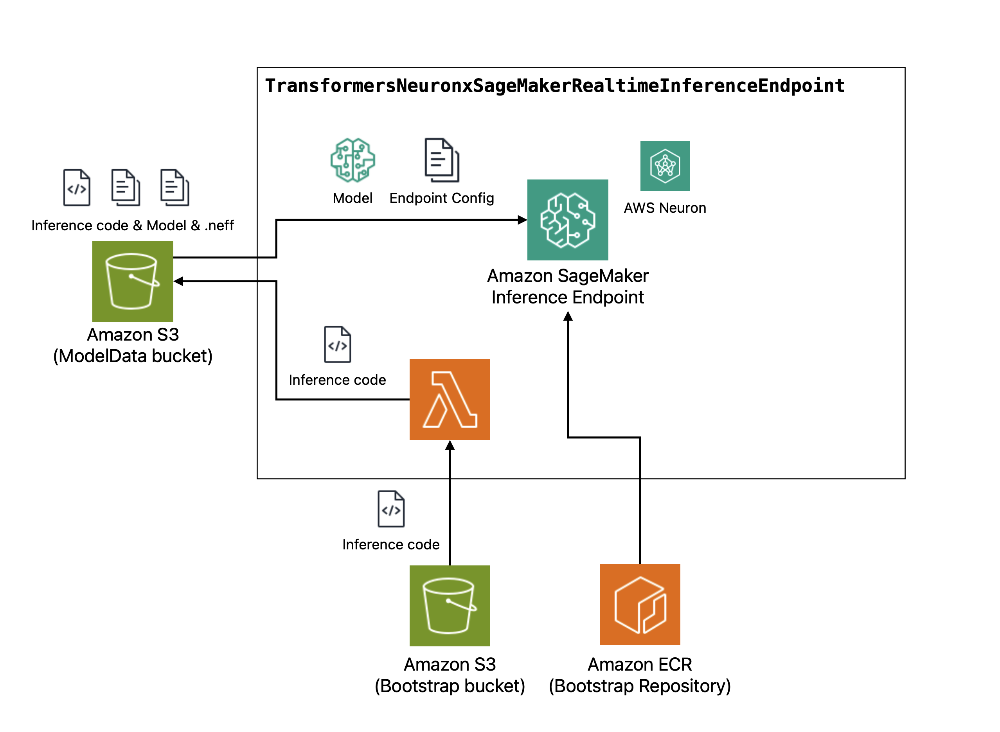
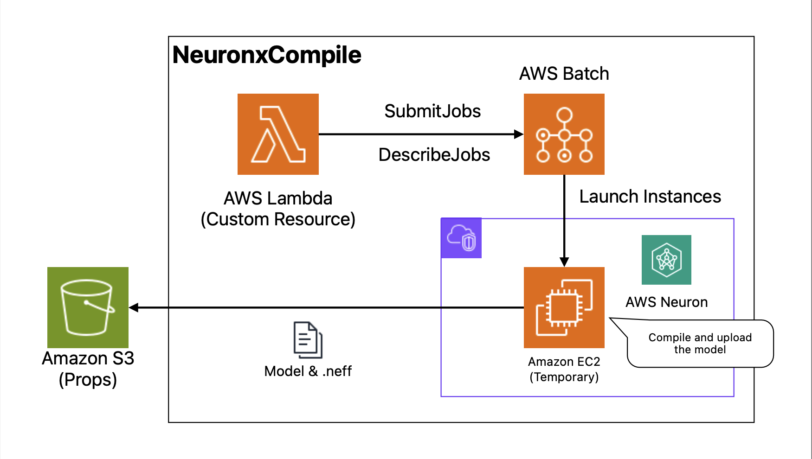

# Neuronx patterns Construct Library

> [!WARNING]
> This library is experimental module.

This library provides high-level architectural patterns using neuronx (e.g. Inferentia2 and Trainium1). It contains:

- Transformers Neuronx SageMaker Real-time Inference Endpoint
- Neuronx Compile

## Transformers Neuronx SageMaker Real-time Inference Endpoint

> [!WARNING]
> This construct uses an Inferentia2 instance on SageMaker. You may need to increase your request limit for your AWS account.

By using the `NeuronxCompile` construct included in this construct library, models published on HuggingFace can be easily deployed to SageMaker Real-time inference. To define using the `NeuronxCompile` construct:

```ts
import * as ec2 from "aws-cdk-lib/aws-ec2";
import * as s3 from "aws-cdk-lib/aws-s3";

declare const vpc: ec2.Vpc;
declare const bucket: s3.Bucket;
const compile = new NeuronxCompile(this, "NeuronxCompile", {
  vpc,
  bucket,
  model: Model.fromHuggingFace("example/example-7b-chat", {
    parameters: Parameters.billion(7),
  }),
});
new TransformersNeuronxSageMakerRealtimeInferenceEndpoint(
  this,
  "RealtimeInference",
  {
    modelData:
      TransformersNeuronxSageMakerInferenceModelData.fromNeuronxCompile(
        compile,
      ),
  },
);
```

This is TransformersNeuronxSageMakerRealtimeInferenceEndpoint architecture.


### Default inference code

By default, default inference code is deployed to implement the chat interface. The default inference code takes an object array like [transformers' conversations](https://huggingface.co/docs/transformers/main/en/conversations) and responds to the generated text. The following code is an example using the AWS SDK for JavaScript v3.

```ts
import {
  InvokeEndpointCommand,
  SageMakerRuntimeClient,
} from "@aws-sdk/client-sagemaker-runtime";

const client = new SageMakerRuntimeClient({
  region: "us-east-1",
});
client
  .send(
    new InvokeEndpointCommand({
      EndpointName: "my-endpoint-id",
      Body: JSON.stringify({
        // Optional. You can change answer role.
        role: "ai",
        // Require. The messages like conversation.
        messages: [
          {
            role: "system",
            content: `You are helpfull assistant.`,
          },
          {
            role: "user",
            content:
              "please answer '1+1=?'. You must answer only answer numeric.",
          },
        ],
      }),
      ContentType: "application/json",
      Accept: "application/json",
    }),
  )
  .then((res) => {
    // { generated_text: "2" }
    console.log(JSON.parse(res.Body.transformToString()));
  });
```

To use your own inference code, you can pass the code to model data option.

```ts
import * as s3Deplyment from "aws-cdk-lib/aws-s3-deployment";

declare const compile: NeuronxCompile;
new TransformersNeuronxSageMakerRealtimeInferenceEndpoint(
  this,
  "RealtimeInference",
  {
    modelData:
      TransformersNeuronxSageMakerInferenceModelData.fromNeuronxCompile(
        compile,
        s3Deplyment.Source.asset("path/to/my/code/directory"),
      ),
  },
);
```

## Neuronx Compile

> [!WARNING]
> This construct uses an Inferentia2 instance on EC2. You may need to increase your request limit for your AWS account.

This construct compiles models supported by Neuronx and uploads them to the specified S3 bucket. To define

```ts
import * as ec2 from "aws-cdk-lib/aws-ec2";
import * as s3 from "aws-cdk-lib/aws-s3";

declare const vpc: ec2.Vpc;
declare const bucket: s3.Bucket;
const compile = new NeuronxCompile(this, "NeuronxCompile", {
  vpc,
  bucket,
  model: Model.fromHuggingFace("example/example-7b-chat", {
    parameters: Parameters.billion(7),
  }),
});

// Get the compiled artifacts from this S3 URL
new CfnOutput(this, "CompiledArtifact", {
  value: compile.compiledArtifactS3Url,
});
```

This construct assumes the required instance type depending on the number of model parameters.

After compiled, you can see like the this file tree in the S3 bucket.

```txt
{compiledArtifactS3Url}/
├── model
│   ├── config.json
│   ├── tokenizer_config.json
│   ├── xxx.safetensors
│   └── xxx.safetensors
└── compiled
    ├── xxx.neff
    ├── xxx.neff
    └── xxx.neff
```

This is NeuronxCompile architecture.


### Spot Instance

> [!WARNING]
> If you use Spot Instances, check if the request limit for Spot has been increased.

You can also use Spot Instances.

```ts
import * as ec2 from "aws-cdk-lib/aws-ec2";
import * as s3 from "aws-cdk-lib/aws-s3";

declare const vpc: ec2.Vpc;
declare const bucket: s3.Bucket;
new NeuronxCompile(this, "NeuronxCompile", {
  vpc,
  bucket,
  model: Model.fromHuggingFace("example/example-7b-chat", {
    parameters: Parameters.billion(7),
  }),
  spot: true,
});
```

### Compile Options

If you are familiar with Neuronx, you can also specify compilation options to better meet your requirements.

```ts
import * as ec2 from "aws-cdk-lib/aws-ec2";
import * as s3 from "aws-cdk-lib/aws-s3";

declare const vpc: ec2.Vpc;
declare const bucket: s3.Bucket;
new NeuronxCompile(this, "NeuronxCompile", {
  vpc,
  bucket,
  model: Model.fromHuggingFace("example/example-22b-chat", {
    parameters: Parameters.billion(22),
  }),
  compileOptions: {
    nPositions: 1024,
    quantDtype: QuantDtype.S8,
    optLevel: OptLevel.MODEL_EXECUTION_PERFORMANCE,
  },
});
```
